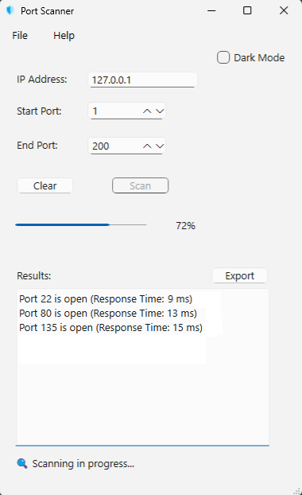

### 🛡️ Port Scanner
Simple TCP port scanner with a clean Qt GUI.
Enter an IP and port range, scan, and view open ports with response times.

### Features
- Built with C++ and Qt

- Asynchronous port scanning

- Lightweight and fast

- Cross-platform

### Build

```bash
git clone https://github.com/anthony-reese/port-scanner.git  
cd port-scanner  
mkdir build && cd build  
cmake ..  
cmake --build .  
```
or open the project in Qt Creator and click Build ➔ Run.

### Screenshot


### License
[MIT](https://mit-license.org)